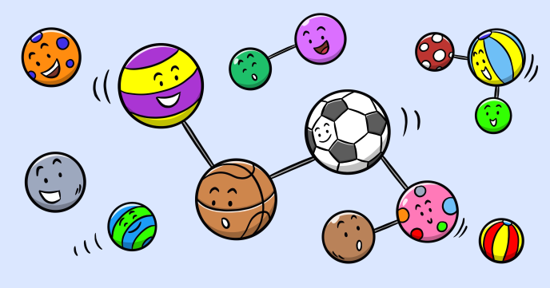

Mutual connections is a nice graphic effect that is very easy to implement.

You start by bouncing a ball from the edges of the canvas, then extend it to more balls and finally add connections between the balls when the distance between any two balls is less than a certain threshold.
 
## Source code 
The JavaScript source code of this program can be found [here](sketches/program.js). To run it, you need to import it in the [codeguppy.com](https://codeguppy.com) online editor. Alternatively, you can use the source code in your p5.js sketches (advanced use). 
## Online version 
To see the code running, check the online playground at [https://codeguppy.com/code.html?t=mutual_connections](https://codeguppy.com/code.html?t=mutual_connections) 
## Next steps 
Please check [codeguppy.com](https://codeguppy.com) for many other fun JavaScript programs and games for beginners. To stay up to date with CodeGuppy development please follow [@codeguppy](https://twitter.com/codeguppy) on Twitter.  
